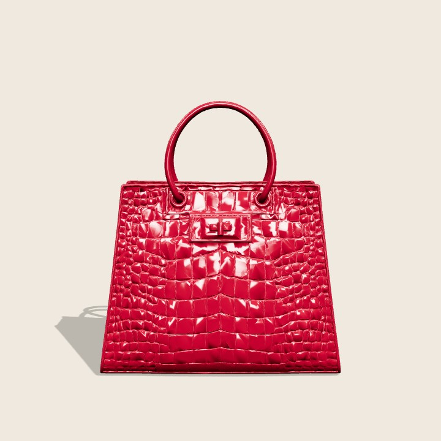

# 📝 프로젝트 소개 및 회고 — LUMEN Atelier 3D 핸드백 쇼핑몰

## 1. 프로젝트 요약 (무엇을 만들었는가?)

**Three.js와 생성형 AI로 만든 3D 인터랙티브 핸드백 쇼핑몰**입니다.
일반 쇼핑몰의 2D 상품 이미지 대신, 사용자가 **3D 제품을 직접 회전시키고 색상을 바꿔가며**
살펴볼 수 있는 제품 상세페이지를 구현했습니다.

- 방문자는 명품 브랜드 감성의 상세페이지에서
- 핸드백을 360° 돌려보고, 6가지 컬러를 실시간으로 바꿔보며,
- 수량을 골라 장바구니에 담는 실제 쇼핑 경험을 하게 됩니다.

3D 모델은 **Meshy(생성형 AI)** 로 만든 크로크 가죽 토트백을 사용했습니다.

---

## 2. 사용한 기술 스택

| 분류 | 기술 |
|------|------|
| 3D 모델 생성 | **Meshy** (생성형 AI · Text-to-3D) |
| 모델 최적화 | **glTF-Transform** (40MB → 2MB) |
| 3D 엔진 | **Three.js r161** (WebGL) |
| 카메라 제어 | OrbitControls (마우스 회전) |
| 모델 로드 | GLTFLoader (`EXT_texture_webp`, `KHR_mesh_quantization`) |
| 조명 | RoomEnvironment + PMREMGenerator (IBL), Directional/Hemisphere Light |
| 렌더링 품질 | ACESFilmicToneMapping, PCFSoftShadowMap (부드러운 그림자) |
| 프론트엔드 | HTML5, CSS3(Grid/Flexbox 반응형), Vanilla JS (ES Modules + import map) |
| 배포 | Netlify (정적 호스팅) |
| AI 활용 | ChatGPT / Claude — UI/UX 설계, 카피라이팅, 코드 구현 |

---

## 3. 주요 기능 소개 (스크린샷 포함)

### ① 생성형 AI 3D 모델 + 실시간 색상 변경
Meshy로 생성한 크로크 가죽 토트백. 6색 스와치를 누르면 표면 질감은 유지된 채
색상만 부드럽게 바뀝니다.

| Classic Black | Ruby Red (색상 변경) |
|---|---|
|  |  |

### ② 3D 회전 인터랙션
- 마우스 드래그로 자유 회전 (OrbitControls, 관성 damping)
- `↺ / ↻` 버튼으로 45°씩 부드럽게 회전 (목표 각도로 lerp 보간)
- 자동 회전(턴테이블) 토글 · 시점 초기화 버튼

### ③ 쇼핑몰 UI/UX
- 가격/할인율, 별점·리뷰 수, 컬러·수량 옵션
- 장바구니 담기 → 카운터 증가 애니메이션 + 토스트 알림
- 특징 카드 · 스펙 스트립 · 고객 리뷰 · 반응형(모바일 하단 고정 구매바)

---

## 4. 회고 및 느낀 점

### 어려웠던 점과 해결 방법

**① 생성형 AI 3D 도구의 유료 다운로드 장벽**
- 문제: Tripo3D로 모델을 생성했지만 **GLB 다운로드가 유료 구독 전용**이었습니다.
  Meshy로 옮겨서 다시 생성했더니 이쪽은 **무료 등급에서 CC BY 4.0으로 다운로드**가 가능했습니다.
- 배운 점: 요즘 생성형 3D 서비스는 "생성은 무료, 내보내기는 유료"인 경우가 많아,
  **다운로드(내보내기) 가능 여부를 먼저 확인**하는 게 중요했습니다.

**② 40MB짜리 무거운 모델을 웹에 얹기**
- 문제: Meshy 모델이 **40MB**(4K 텍스처 + 70만 삼각형)라 웹에 부적합했습니다(권장 10MB).
- 해결: `glTF-Transform`으로 **지오메트리 단순화(706k→105k), 텍스처 축소(4K→1K WebP),
  정점 양자화**를 적용해 **2MB로 경량화**했습니다. Three.js가 별도 디코더 없이 지원하는
  포맷(WebP/양자화)만 사용해 배포 안정성도 확보했습니다.

**③ 텍스처가 있는 모델에서 색상 변경 구현**
- 문제: AI 모델에는 가죽 색이 텍스처로 구워져 있어, 그대로면 색상 버튼이 먹히지 않았습니다.
- 해결: **베이스컬러 텍스처만 제거하고 노멀·러프니스 맵은 유지**한 뒤 색상을 코드(`material.color`)로
  제어했습니다. 그 결과 **크로크 질감은 살아 있으면서 6색이 선명하게** 바뀝니다.

**④ 버튼 회전이 뚝뚝 끊기는 문제**
- 해결: 목표 각도(`targetRotationY`)를 두고 `requestAnimationFrame` 루프에서 매 프레임
  현재 각도를 목표로 보간(lerp)해 부드러운 회전을 만들었습니다.

### 배운 점
- Three.js 씬 그래프(Scene → Group → Mesh) 구조와 GLTF 모델 로딩·재질 제어.
- **애니메이션 = 목표를 향해 매 프레임 보간(rAF + lerp)** 이라는 감각.
- 조명·환경맵·톤매핑이 사실감의 대부분을 좌우한다는 점.
- **3D 에셋 파이프라인**(생성 → 최적화 → 웹 로드)을 처음부터 끝까지 경험.

### 느낀 점
2D 이미지 몇 장으로 끝나던 상품 소개가 사용자가 직접 만지고 돌려보는 경험으로 바뀌니
몰입감이 확연히 달랐습니다. 특히 "AI로 만든 모델을 실제 웹에서 돌아가게 만드는" 전 과정을
직접 겪으며, 생성형 AI와 웹 기술을 잇는 감을 잡을 수 있었습니다.

---

## 5. 제출 항목 체크리스트

- [x] 생성형 AI(Meshy)로 3D 모델 생성
- [x] Three.js로 3D 씬 구성 (카메라·조명·OrbitControls·모델 로드)
- [x] 3D 인터랙션 (회전·색상 변경) 구현 및 동작 확인
- [x] 쇼핑몰형 레이아웃 · UI/UX 구성
- [x] 프로젝트 소개 및 회고 문서 작성
- [x] Netlify 배포 완료 — https://gilded-daifuku-a0a7df.netlify.app
- [ ] GitHub 저장소 URL 기입 *(push 후 README에 추가)*
